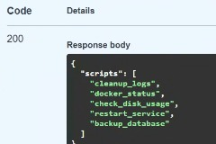
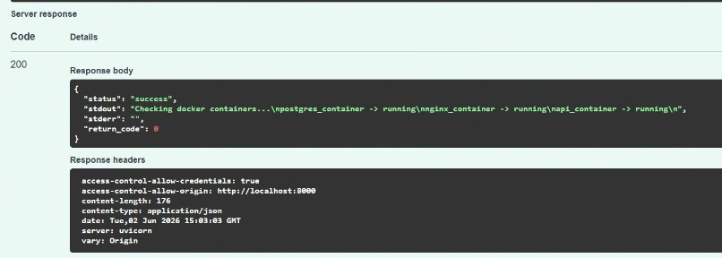
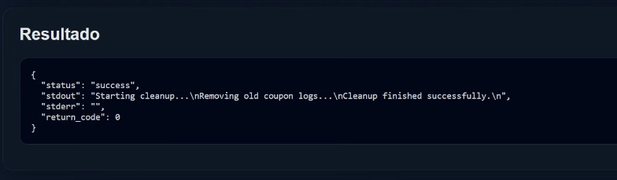
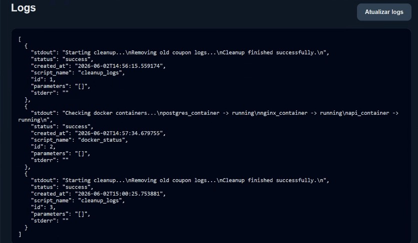
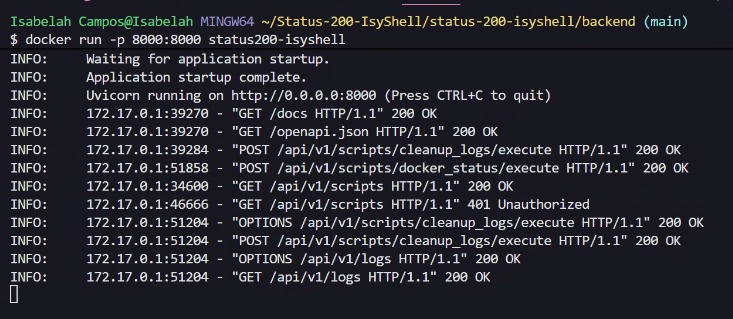

# 

### 

# 🔐 Status 200 IsyShell


## 📌 Descrição

O **Status 200 IsyShell** é uma solução desenvolvida para o desafio da **ISY.ONE** no Hackathon Tech FMU, com foco em automação segura de rotinas técnicas por meio de uma API.

A proposta do projeto é substituir execuções manuais de scripts no terminal por chamadas de API autenticadas, controladas e auditáveis. Dessa forma, tarefas como limpeza de logs, verificação de containers, checagem de disco, reinício de serviço e backup podem ser executadas de forma padronizada, com registro de cada operação realizada.

O sistema conta com uma API em **FastAPI**, autenticação via token, execução de scripts autorizados, armazenamento de logs em banco SQLite, documentação via Swagger e duas interfaces web: uma versão simples em HTML/CSS/JS e uma versão premium em React/Vite.

## ✨ Funcionalidades

- 🔐 **Autenticação por Token:** Todas as rotas protegidas exigem o header `X-Isy-Token`.
- 📜 **Catálogo de Scripts Autorizados:** Apenas scripts previamente cadastrados podem ser executados.
- ⚙️ **Execução Controlada de Scripts:** A API executa scripts shell de forma padronizada e segura.
- 🧾 **Logs de Auditoria:** Cada execução gera um registro com status, saída, erros e data/hora.
- 📚 **Documentação Swagger:** A API possui documentação automática para testes e validação.
- 🐳 **Execução com Docker:** O backend roda em container Docker.
- 🖥️ **Frontend Simples:** Interface em HTML, CSS e JavaScript para operação básica.
- 🚀 **Frontend React Premium:** Interface mais robusta em React/Vite para demonstração do produto.

## 🛠️ Tecnologias Utilizadas

As principais ferramentas utilizadas no projeto foram:

- **Python** → Linguagem principal utilizada no backend.
- **FastAPI** → Framework utilizado para criação da API.
- **SQLAlchemy** → ORM utilizado para manipulação dos dados.
- **SQLite** → Banco de dados utilizado para armazenar os logs de auditoria.
- **Shell Script** → Scripts simulando rotinas técnicas reais.
- **Docker** → Containerização da aplicação backend.
- **Swagger/OpenAPI** → Documentação e testes das rotas da API.
- **HTML5, CSS3 e JavaScript** → Desenvolvimento do frontend simples.
- **React + Vite** → Desenvolvimento do frontend premium.
- **Git e GitHub** → Versionamento e hospedagem do código-fonte.

## 🧠 Decisões de Desenvolvimento

Durante o planejamento e execução, algumas decisões foram tomadas para tornar a solução mais segura, organizada e adequada ao desafio:

1. **Execução apenas de scripts autorizados** → A API não permite que o usuário envie comandos livres para o servidor. Apenas scripts cadastrados no backend podem ser executados.
2. **Autenticação obrigatória** → Todas as rotas principais exigem o header `X-Isy-Token`, bloqueando acessos não autorizados.
3. **Auditoria das execuções** → Cada script executado gera um log no banco de dados, permitindo rastreabilidade das operações.
4. **Uso de Docker** → O backend foi containerizado para facilitar a execução e padronizar o ambiente.
5. **Frontend separado do backend** → A interface consome a API por meio de requisições HTTP, mantendo uma arquitetura mais organizada.
6. **Scripts simulando situações reais** → Os scripts foram pensados com base em rotinas comuns de infraestrutura e operação, como backup, limpeza de logs e verificação de containers.

## 📜 **Scripts Autorizados** 

A API trabalha com um catálogo de scripts permitidos. Isso impede a execução livre de comandos no servidor.

 `cleanup_logs`  Simula a limpeza de logs antigos do sistema 
 
 `docker_status`  Verifica o status de containers simulados 
 
 `check_disk_usage`  Analisa o uso de disco 
 
 `restart_service`  Simula o reinício de um serviço 
 
 `backup_database`  Simula o backup de um banco de dados 
 
## 🔐 **Autenticação**

Header obrigatório:

`X-Isy-Token`

Token utilizado no projeto:

`isy-secret-token`

## 📷 Preview

Abaixo estão alguns registros da aplicação em funcionamento, demonstrando a API, a autenticação, a execução dos scripts e os logs de auditoria.

### 🔎 Listagem de Scripts Autorizados

A rota de listagem retorna os scripts cadastrados no catálogo da API, garantindo que apenas automações previamente autorizadas possam ser executadas.



---

### ⚙️ Execução de Script com Retorno `200 OK`

Exemplo de execução de script pela documentação Swagger, retornando status de sucesso e saída estruturada da operação.



---

### 🖥️ Resultado da Execução no Frontend

Interface exibindo o retorno da API após a execução de um script autorizado.



---

### 🧾 Logs de Auditoria

Tabela/listagem de logs registrando as execuções realizadas, com nome do script, status, saída, erros e data/hora.



---

### 🐳 Backend Rodando com Docker e Validação de Requisições

Registro do backend em execução via Docker, com a API recebendo requisições reais e retornando respostas HTTP como `200 OK` para execuções válidas e `401 Unauthorized` para token inválido.



## 🚀 Como Rodar o Projeto

Para executar o projeto localmente, é necessário rodar o backend e o frontend separadamente.

### **1️⃣ Clone o repositório**

```bash
git clone https://github.com/isahpao/Status-200-IsyShell
```

Acesse a pasta principal do projeto:

```bash
cd Status-200-IsyShell/status-200-isyshell
```

### **2️⃣ Rodar o Backend com Docker**

#### Opção recomendada: Docker Compose

Execute:

```bash
docker compose up --build
```

Esse comando constrói a imagem Docker e inicia a API automaticamente.

A API ficará disponível em:

```txt
http://localhost:8000
```

A documentação Swagger pode ser acessada em:

```txt
http://localhost:8000/docs
```

---

#### Opção alternativa: Docker manual

Caso prefira rodar manualmente, acesse a pasta do backend:

```bash
cd backend
```

Construa a imagem Docker:

```bash
docker build -t status200-isyshell .
```

Execute o container:

```bash
docker run -p 8000:8000 status200-isyshell
```

### **3️⃣ Rodar o Frontend Simples**

Abra o arquivo diretamente no navegador ou utilize uma extensão como o Live Server no VS Code para uma visualização mais dinâmica.

```txt
frontend/index.html
```

A interface conseguirá consumir a API em:

```txt
http://localhost:8000
```

### **4️⃣ Rodar o Frontend Premium**

Em outro terminal, acesse a pasta do frontend React:

```bash
cd frontend-lovable
```

Instale as dependências:

```bash
npm install
```

Execute o projeto:

```bash
npm run dev
```

O frontend será iniciado em uma porta local, como:

```txt
http://localhost:8080
```

ou:

```txt
http://localhost:5173
```

Com o backend rodando na porta `8000`, o frontend React conseguirá executar os scripts autorizados e exibir os logs de auditoria.

## **Testes Realizados:**

✅ API iniciando corretamente via Docker.

✅ Swagger acessível em http://localhost:8000/docs.

✅ Listagem dos 5 scripts autorizados.

✅ Execução dos scripts com retorno 200 OK.

✅ Bloqueio de token inválido com retorno 401 Unauthorized.

✅ Registro das execuções no banco SQLite.

✅ Consulta dos logs pela rota /api/v1/logs.

✅ Integração com o frontend simples.

✅ Integração com o frontend React premium.


